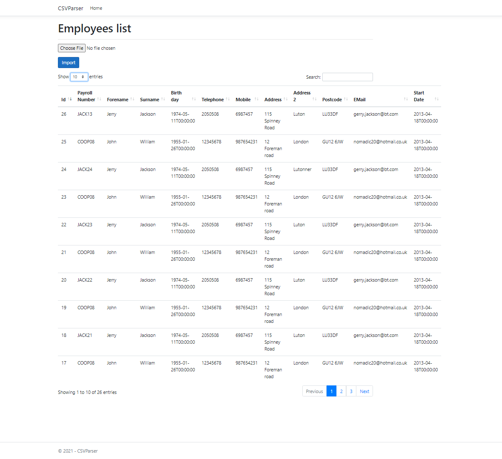
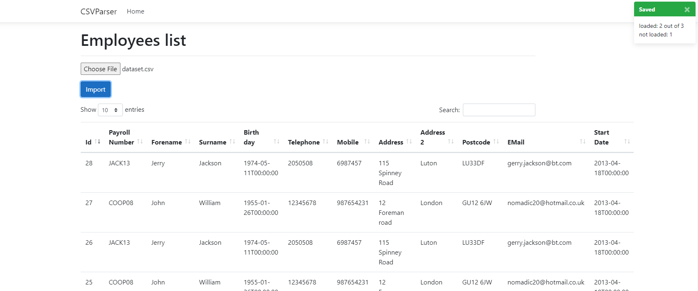
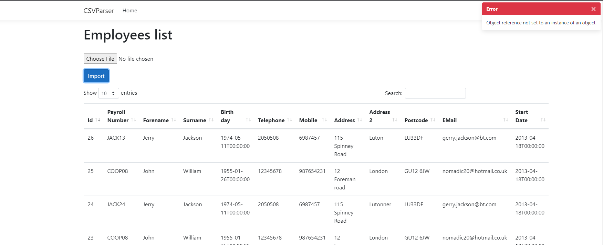
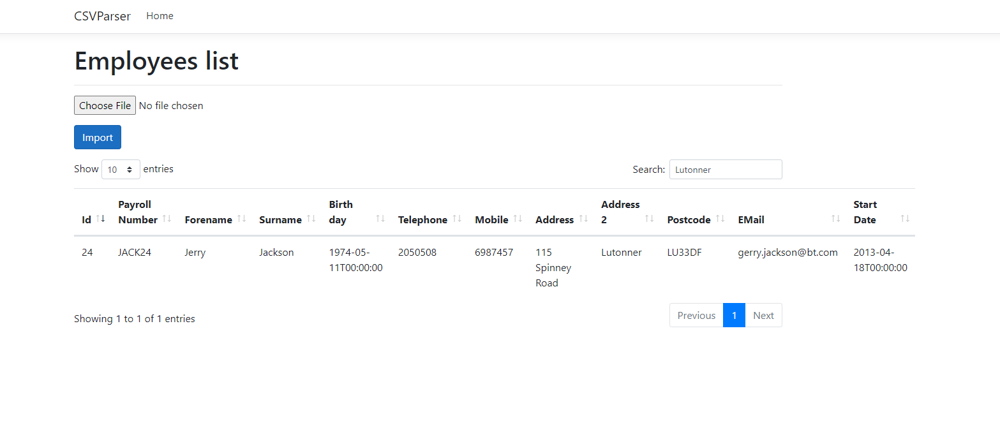

# CSV upload project

.Net MVC project to upload ```.csv``` content into database.

### Projects contents
*  CSVParse project
*  CSVParserUnitTest

### Used tools
* [DotNet core v5](https://dotnet.microsoft.com/download)
* [Bootstrap v4.3.1](https://getbootstrap.com/)
* [jQuery JavaScript Library v3.5.1](https://jquery.com/)
* [DataTables v1.11.3](https://cdn.datatables.net/1.11.3/js/jquery.dataTables.min.js)
* [bootstrap-toast](https://www.jqueryscript.net/other/bootstrap-toasts-manager.html)



### Prepearing database

In project used Entity framework, at the beginning you have to migrate database first.
Add connection string to ```appsettings.json``` file 

```
Add-Migration migration1
Update-Database
```

you can compile for now.

### Uploading files

when your upload a file is executed successfully you will see ```toastr``` modal upper top right corner of the page with the summary result of uploaded rows from ```.csv``` file.



when your upload incorrect file or damaged file you will get error ```toast```
 


### Server side process
All search and sort requests will be processessed on server side. 
During the search, all ```datatables``` parameters will be recalculated. 

In the following described search result, you can check datatables parameters are changing dependently to response of server.

